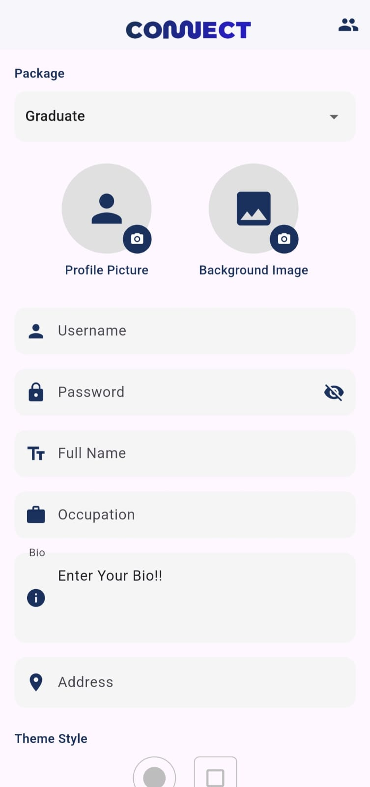
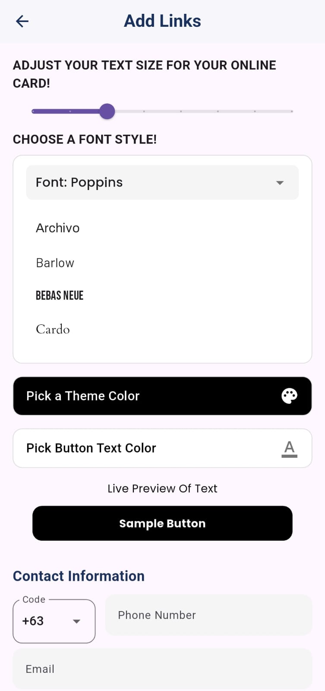
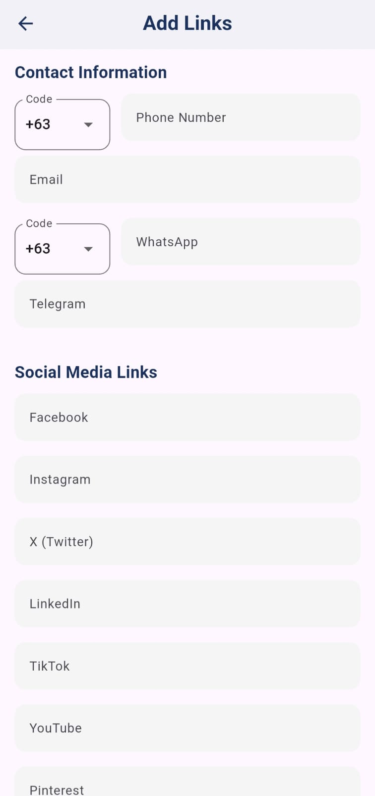
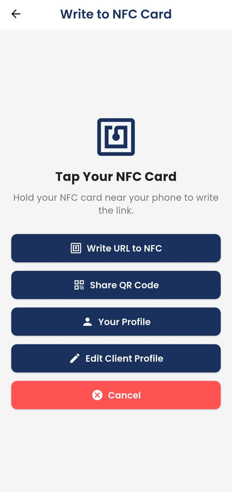

# Connect Cards Creator – Digital Profile Builder for NFC

**Type:** Mobile App • **Built With:** Flutter + Firebase Firestore  
**Status:** Private (Code not publicly available)

Connect Cards Creator is a dynamic profile-building app made for admins and affiliates who need to create, manage, and share digital business cards. With distinct modes for Basic and Premium users, it offers a flexible and scalable system to generate stylish profiles linked to QR codes or NFC smart cards.

---

## ✨ Key Features

- **Secure Login System**
  - Authenticates users through Firebase using username and password
  - Determines access level (Basic or Premium) based on user role set by the admin

- **Role-Based Experience**
  - **Basic Users**: Access to limited input fields and simplified customization
  - **Premium Users**: Full access to extended fields, styling options, and advanced sharing tools

- **Profile Builder**
  - Add personal info: name, username, email, phone number, etc
  - Upload profile and background images
  - Set a secure password
  - Write a short bio or role/occupation and much more

- **Customizable Appearance**
  - Theme selection: change text colors, layouts, and themes
  - Font styles and text size options
  - Live previews to see how elements look in real-time

- **Link & Contact Management**
  - Add social media and website links
  - Input is validated to ensure proper format
  - Provides many platform fields for Premium users
  - Has multiple country codes to pick from

- **QR Code Integration**
  - Automatically generate QR codes linked to profiles
  - Save QR codes locally to your device
  - Share QR codes via system share sheet

- **NFC Writer**
  - Write the generated profile URL to an NFC card
  - Streamlined process for mobile-based writing

- **Affiliate User Management**
  - View all sub-profiles (users) created under the current account
  - Edit or update sub-user data directly

- **Profile Sharing**
  - Share profile URLs through various channels
  - Designed for easy integration with social or professional platforms

- **More**
  - Clean, mobile-first design for non-technical users
  - provides a link to view your profile
  - is connected to a basic order tracking system in the Admin app
  - has a order confirmation button that'll send the client an email
  - Responsive feedback and user-friendly navigation

- **Under Construction**
  - Working on adding custom fields

---

## 📸 Preview

> This project is private, but here’s a look at what it does:

- 
- 
- 
- 

---

## 🔒 Code Access

The source code is **not publicly available**. If you're a collaborator, please request access.

---

## 🧑‍💻 Built By

**Rania Jarral**  
Email: raniajarral9.email@gmail.com  
GitHub: [@raniajarral](https://github.com/raniajarral)

---
