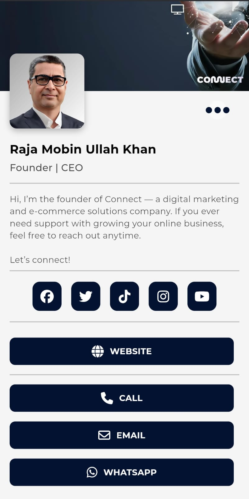

# Connect Cards – NFC Business Profile Viewer

**Type:** Web • **Built With:** Flutter + Firebase Firestore  

Connect Cards is a tap-to-share business profile app built for students, professionals, and freelancers. Users can instantly share a clean, fully customized personal profile using NFC or QR code technology. It focuses on a minimal, elegant presentation of the user’s key information.

---

## Key Features

- **Display Profile Info**: Name, bio, and occupation
- **Show Contact Info**: Email and phone (tap-to-call and email)
- **Social Links**: Instagram, LinkedIn, and more
- **Profile & Background Images**: Add your personal branding
- **Custom Themes**: Font, text size, and color customization
- **QR Code Sharing**: Share via QR for non-NFC devices
- **Live Styling**: Themes reflect instantly on profile
- **Fully Responsive**: Optimized for mobile viewing

---

## Preview

> This project is private, but here’s a look at what it does:
https://your-profile.web.app/mobin
- 
- 

---

## 🧑‍💻 Built By

**Rania Jarral**  
Email: rania.jarral@connectprax.com

---
