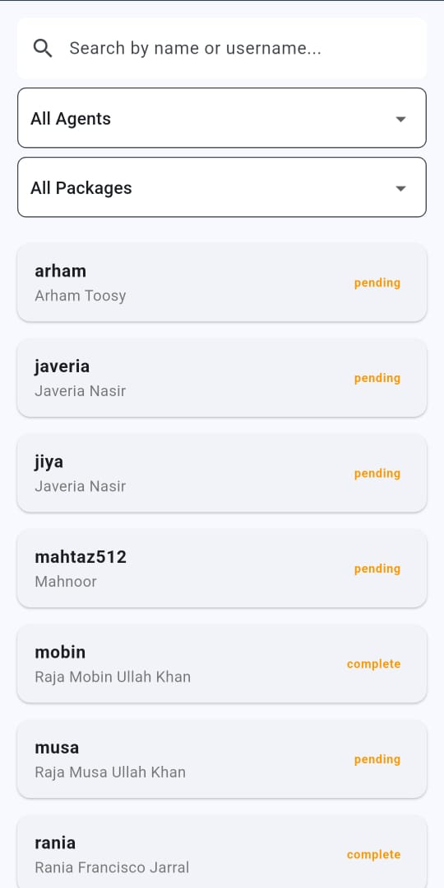
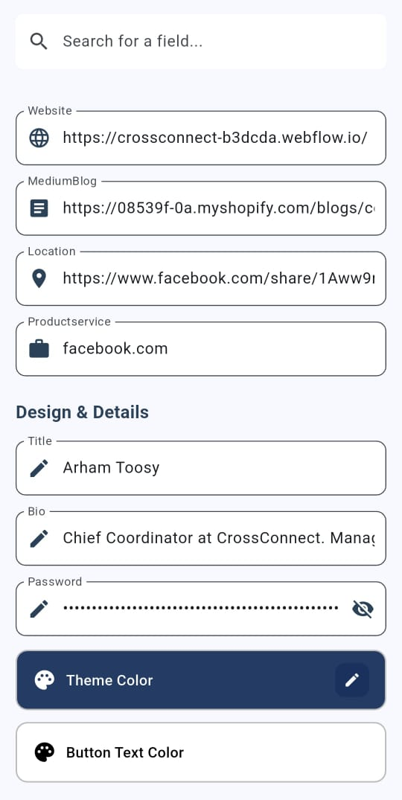
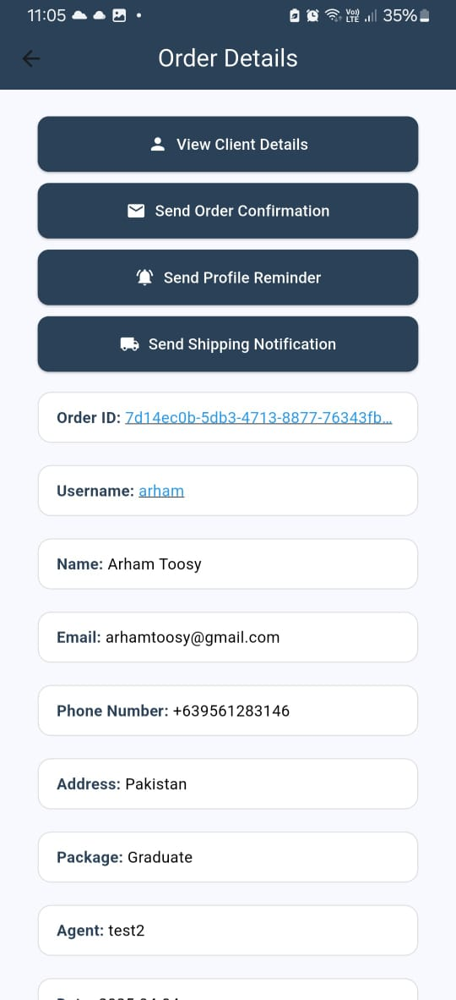

# PRAX ADMIN – Mobile Business Management App

**Type:** Mobile App • **Built With:** Flutter + Firebase Firestore  
**Status:** Private (Code not publicly available)

PRAX ADMIN is a mobile-first backend management app built to streamline order tracking, affiliate performance, and client handling. Designed for business owners and team admins, it centralizes operational control in an intuitive, fast, and flexible interface — all from your phone.

---

## Key Features

- **Affiliate Management**: Monitor affiliate performance and account details
- **Client Management**: View and organize customer profiles
- **Order Tracking**: Track orders and update their statuses
- **Search & Filters**: Quickly find clients, orders, or affiliates
- **Edit Agent Data**: Modify affiliate or team member information on the go
- **Firebase Firestore Backend**: Realtime, cloud-based database
- **Mobile-Optimized UI**: Minimal, fast, and easy to use
- **Coming Soon**:
  - **Order Confirmation Emails**
  - **Shipping Status Email Reminders**

---

## Preview

- 
- 
- 
- 

---

## Built By

**Rania Jarral**  
Email: raniajarral9.email@gmail.com  
---
